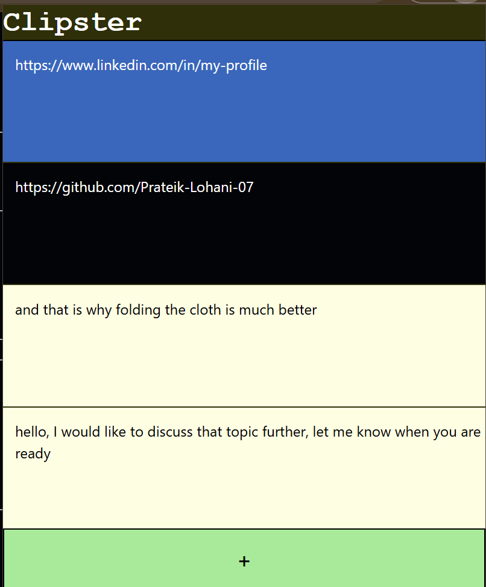

# Clipster

Clipster is an easy-to-use, lightweight clipboard, provided as a chrome extension.

It has a simple 90's websites inspired UI.
Built with: React + Typescript + Tailwind.

Clipster stores text right in your browser, in your local storage. You can click on the text box as many times as you want and that will copy the text.

Additionally, clipster also provides color coding your clips with 6 different colors so you can copy text faster visually.
